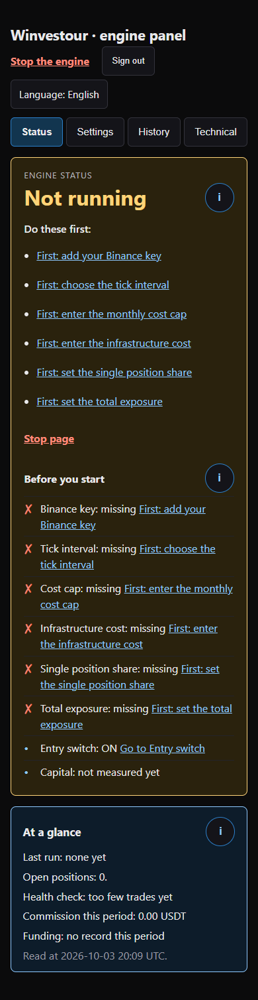
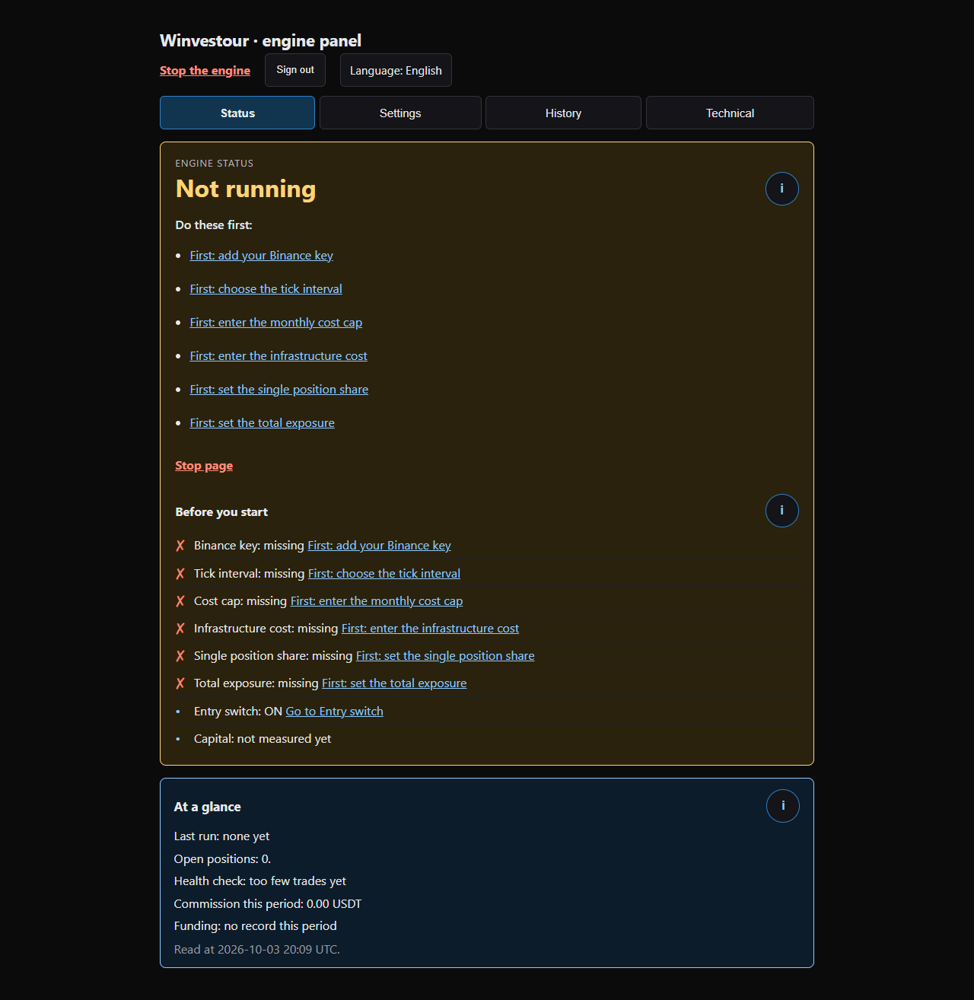
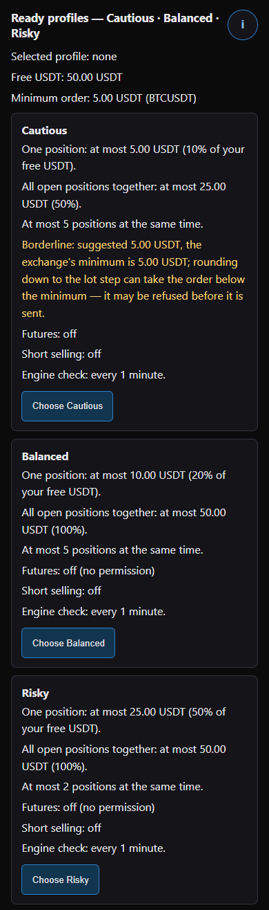
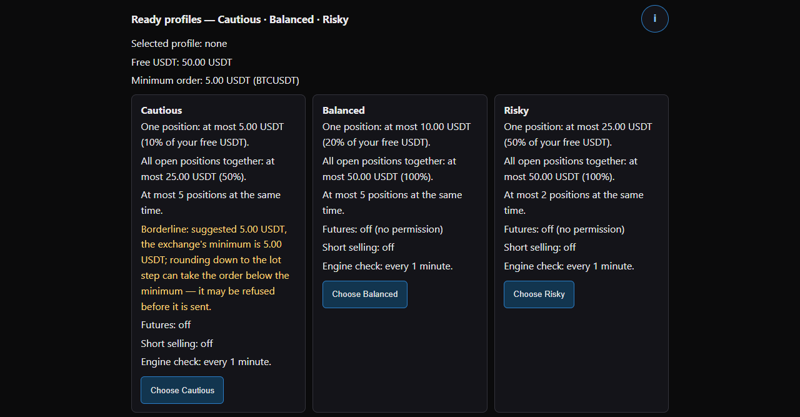
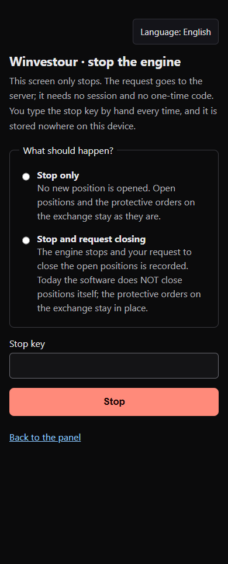
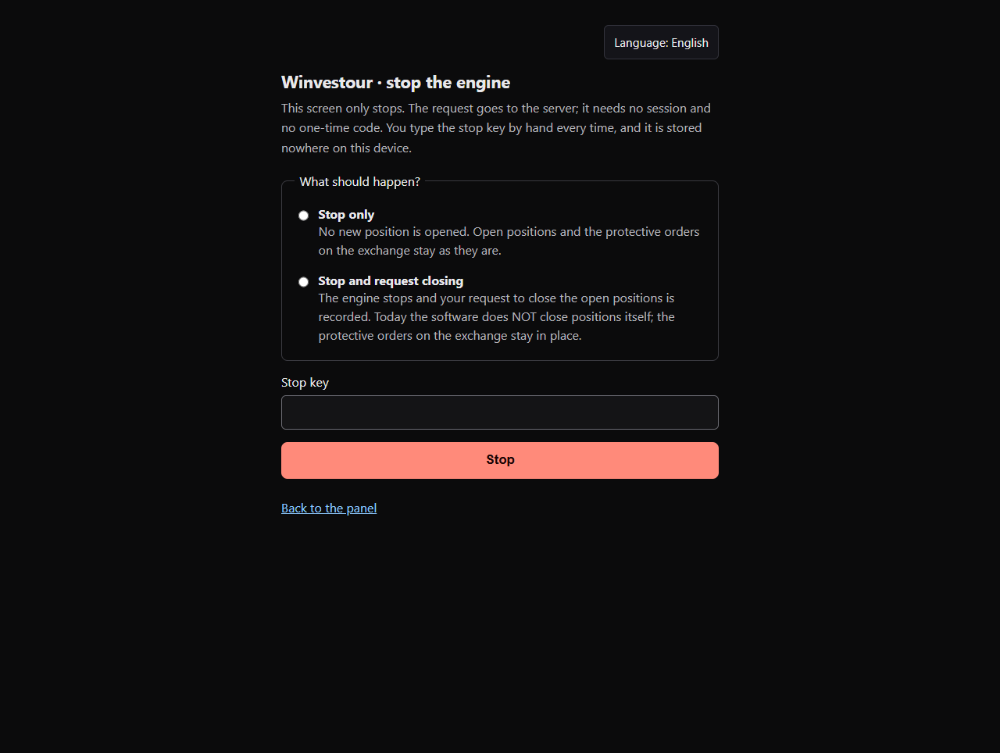

# Open-source, self-hosted crypto trading bot for Binance — bring your own API keys

[English](README.md) · [Türkçe](README.tr.md) · [Deutsch](README.de.md) · [Русский](README.ru.md) · [Italiano](README.it.md) · [Français](README.fr.md) · [العربية](README.ar.md)

In caso di contraddizione fa fede il testo inglese.

<!-- readme:intro -->
## Cos'è

`winvestour-bot` è un piccolo motore di trading che esegui **sui tuoi account**: legge il mercato spot di Binance con la **tua** chiave API, decide con regole che un modello Claude scrive una volta al giorno e può inviare ordini reali sul tuo conto. Ogni installazione è una copia a sé — il database, la chiave Binance e la chiave API di Claude restano nel tuo hosting, e nulla in questa copia richiama il manutentore. È pensato per una persona che vuole eseguire un motore del genere per sé, leggere prima il codice e iniziare con una piccola somma.

**Indice:** [Cosa serve](#cosa-serve) · [Installare con un assistente IA](#installare-con-un-assistente-ia) · [Installazione](#installazione) · [Primo utilizzo](#primo-utilizzo) · [Costo mensile di esercizio](#costo-mensile-di-esercizio) · [FAQ / risoluzione dei problemi](#faq--risoluzione-dei-problemi) · [Contribuire](CONTRIBUTING.md)

<!-- readme:warning -->
### ⚠️ Leggi prima di installare

1. **Questo software non è una consulenza finanziaria.** Nessun profitto è promesso. Le misurazioni passate non indicano risultati futuri.
2. **Questo software può inviare da solo ordini reali con denaro reale.** In un'installazione nuova il percorso di ingresso è **ABILITATO per impostazione predefinita.** Nessun ordine viene inviato finché non aggiungi la tua chiave Binance, il tuo capitale e le tue impostazioni di rischio. Puoi disattivarlo dal pannello in qualsiasi momento.
3. **Il rischio di perdita è reale ed è interamente tuo.** Non usare denaro che hai paura di perdere.
4. Il software è fornito **con licenza MIT, "COSÌ COM'È"**, senza alcuna garanzia. L'autore e i collaboratori non si assumono alcuna responsabilità per i tuoi risultati di trading, perdite, interruzioni o difetti.
5. **La conformità è tua responsabilità.** Il trading di criptovalute è limitato o vietato in alcune giurisdizioni; rispettare la legge locale e le condizioni d'uso di Binance è tua responsabilità. Questo progetto non è affiliato a Binance né approvato da Binance.
6. **Le tasse sono tua responsabilità.**
7. Non eseguirlo senza aver letto il codice e averlo provato prima con una piccola somma.

<!-- readme:need -->
## Cosa serve

- **Un account Vercel con piano Pro.** Il motore è guidato da un'attività pianificata che gira **ogni minuto** (`vercel.json`). Il piano gratuito Hobby di Vercel consente un'attività pianificata al massimo **una volta al giorno**, e la sua documentazione dice che una pianificazione più frequente *fallisce durante il deployment* — quindi con Hobby il deployment non va online. Leggi prezzi e condizioni di Vercel prima di scegliere.
- **Un account Neon** (PostgreSQL). Il piano gratuito basta per le tabelle; la sezione sui costi qui sotto dice cosa è stato misurato.
- **Un account Upstash** (Redis). La quota del piano gratuito basta per una posizione aperta alla volta.
- **Una chiave API Anthropic.** Il modello che scrive le regole (il "Cervello") viene chiamato una volta al giorno per impostazione predefinita; un'installazione nuova nasce con il tetto di costo **vuoto**, e finché è vuoto il Cervello **non** viene chiamato.
- **Una chiave API Binance di tipo Ed25519, creata senza permesso di prelievo.** Una chiave con prelievi o trasferimento universale abilitati viene rifiutata e mai salvata.
- **Node.js e npm** sul tuo computer per i comandi di installazione, e circa **un'ora** in totale.

Questa copia non porta nulla del manutentore: il codice non legge alcun nome di dominio, non c'è nessun nome di pacchetto Android né impronta di firma nel contratto d'ambiente, e le tre variabili Firebase dell'estensione facoltativa delle notifiche push nascono vuote, quindi le notifiche sono spente. Tutto ciò che segue nasce vuoto, e lo riempi con i tuoi valori.

| Variabile d'ambiente | Da dove viene il valore |
|---|---|
| `DATABASE_URL` · `DIRECT_URL` | Neon → il tuo progetto → stringhe di connessione (con pool · diretta) |
| `UPSTASH_REDIS_REST_URL` · `UPSTASH_REDIS_REST_TOKEN` | Upstash → il tuo database → REST API. Se aggiungi Upstash dal Vercel Marketplace, imposta invece i nomi `KV_REST_API_URL` e `KV_REST_API_TOKEN`; l'app legge anche quelli. |
| `ANTHROPIC_API_KEY` | Anthropic → chiavi API (inizia con `sk-ant-`) |
| `OWNER_PASSWORD_HASH` · `OWNER_TOTP_SECRET` · `SESSION_SECRET` | il file scritto dal passo d'installazione 4 |
| `STOP_KEY_HASH` | il file scritto dal passo d'installazione 5 |
| `ENCRYPTION_MASTER_KEY` | il file scritto dal passo d'installazione 6 |
| `ENCRYPTION_KEY_VERSION` | `1` in un'installazione nuova (aumentato solo quando ruoti la chiave principale, passo 15) |
| `ENCRYPTION_MASTER_KEY_PREVIOUS` | lascia vuoto; usato solo durante una rotazione della chiave principale |
| `ENGINE_MODE` | `CHEAP` (un tick al minuto dall'attività pianificata; l'unica modalità che questo README descrive) |

La chiave API Binance **non** è una variabile d'ambiente: viene inviata tramite l'app dopo l'installazione e salvata nel tuo database, cifrata con la tua chiave principale (vedi "Primo utilizzo").

## Installare con un assistente IA

Copia il blocco qui sotto così com'è e incollalo in un assistente IA (Claude, ChatGPT, Cursor o simili). Ti guida uno alla volta nei passi numerati della sezione Installazione, ti fa controllare ogni risultato e non ti chiede mai di incollare nella chat una password, una chiave o un valore di `.env`. Il blocco è in inglese di proposito ed è uguale in ogni versione linguistica di questa pagina.

```text
You are helping me install winvestour-bot, a self-hosted crypto trading bot for Binance, from its GitHub README. Follow these rules exactly and go one step at a time.

1. Warning first. This software can place real orders with real money on its own decision. No profit is promised and the risk of loss is entirely mine. Before anything else, tell me to read the whole warning at the top of the README ("Read before you install") and wait until I say I have read it.

2. Vercel Pro. The app must run on a Vercel account on the Pro plan: it runs a scheduled job every minute, and on the free Hobby plan the deployment fails. Tell me this before step 1 and ask whether I have the Pro plan.

3. Secrets. Never ask me to paste passwords, API keys, TOTP secrets or .env values into this chat; tell me which command generates them on my computer and where to paste them.

4. Steps. Take me through the README's Installation steps below, in this order, with exactly these commands. Do not add, skip, reorder or change any command. Step 15 is optional and not part of the setup.
  1. Open the accounts you will need (about 30 minutes in total)
     Check: you can sign in to all five services, and your Binance API key's permissions do not include withdrawals.
  2. Get the code onto your computer
     Check: the folder contains `package.json` and `.env.example`.
  3. Install the dependencies from the copy's lock file
     Command: `npm ci`
     Check: the command ends without an error and a `node_modules` folder appears.
  4. Generate the owner password, the TOTP secret and the session secret
     Command: `npm run owner:credentials`
     Check: the folder now contains owner-credentials.txt, vercel-env-owner.txt; the first holds your password and the TOTP setup key for your authenticator app, the second the three `NAME=value` lines for step 9. No value is printed on screen, only the file paths and short fingerprints.
  5. Generate the stop key (written to the same folder, not printed)
     Command: `npm run stop:credential`
     Check: stop-key.txt, vercel-env-STOP_KEY_HASH.txt appear in the folder; the first holds the raw stop key you will type on the stop screen, the second its hash for step 9.
  6. Generate the master key that encrypts your exchange keys (written to the same folder, not printed)
     Command: `npm run key:encryption-master`
     Check: encryption-master-key.txt, vercel-env-ENCRYPTION_MASTER_KEY.txt appear in the folder.
  7. Generate the Ed25519 key pair for your Binance API key (written to the same folder; the private key is not printed)
     Command: `npm run key:generate`
     Check: binance-private-key.pem, binance-public-key.pem appear in the folder. On Binance choose Profile → API Management → Create API → Self-generated and paste the contents of the second file (the public key); you paste the first file (the private key) into the panel later ("First use").
  8. Create an empty PostgreSQL database
     Check: two strings that start with `postgresql://`; the database has no tables yet.
  9. Give every name in `.env.example` its value — except `ENCRYPTION_MASTER_KEY_PREVIOUS`, which stays empty (it is used only during a master-key rotation), and the three optional `FIREBASE_PROJECT_ID`, `FIREBASE_CLIENT_EMAIL`, `FIREBASE_PRIVATE_KEY`, which also stay empty unless you add your own Firebase for push notifications (see that section below)
     Check: every name in `.env.example` except `ENCRYPTION_MASTER_KEY_PREVIOUS` and the three optional `FIREBASE_*` names has a value. If a required name is missing, the application stops at startup and names the missing variable.
  10. Create the database tables
     Command: `npx prisma migrate deploy`
     Check: the output ends with `All migrations have been successfully applied.` A single migration named `0_baslangic` is applied; every settings table starts with one row; the risk settings are empty and switched off.
  11. Check that the code builds on your computer (recommended before deploying)
     Command: `npm run build`
     Check: the command ends with the list of routes and no error; a `.next` folder appears.
  12. Start it locally
     Command: `npm start`
     Check: the page shows `{"ok":true,"service":"engine",...}`, and `http://localhost:3000/panel` opens and says that the panel needs a session. The environment contract is validated as the server starts: if a required name is missing or malformed the server does not come up, and the error names the missing variable, never its value. Stop the server with Ctrl+C. Running the bot on your own computer is not supported yet: the engine is triggered by Vercel Cron. Local start is only for checking the installation.
  13. Deploy on Vercel
     Check: the deployment reaches Ready, and `https://<your-project>.vercel.app/api/health` returns `{"ok":true,...}`. On the Hobby plan the deployment fails instead, with a message that cron expressions running more often than once per day are not allowed.
  14. Open the panel at `/panel` on your address, and the stop screen at `/durdur`
     Check: both pages open in your browser's language if it is one of this README's seven languages, otherwise in English; you can switch with the language menu at the top of the page. The panel says it needs a session; the stop screen opens without a session and asks for the stop key. Continue with "First use".
  15. OPTIONAL, NOT PART OF SETUP — MASTER KEY ROTATION
     Command: `npm run rotate:encryption-key`
     Check: each row is decrypted with the old key and re-wrapped with the new one in its own transaction, and its version is raised; the new envelope is checked against the new key BEFORE anything is written. Once no row is left on the old version, `ENCRYPTION_MASTER_KEY_PREVIOUS` can be deleted. No key value is ever printed.

5. Checks. After each step, ask me to compare what I see with the Check line of that step. If it does not match, stop, do not improvise a fix, and send me to the README section "FAQ / troubleshooting" and the wiki page FAQ.

6. First use. When the deployment is Ready, guide me through the README section "First use" in this order (the panel and the stop screen open in my browser's language if it is one of the README's seven languages, otherwise in English, and can be switched with the language menu at the top; the README in my language names each screen and button as the panel shows it):
  1. Sign in (owner password, then a one-time code per sensitive action)
  2. Read the Status tab: engine status and "Before you start"
  3. Fill in the Settings tab
  4. Capital
  5. Start the engine
  6. Stop the engine
  7. History and Technical
  8. What this release does not have

7. Updating. When I later ask to update this installation to a new version, take me through the README section "Updating" one step at a time with exactly its commands, and check each step's result as in rule 5. Rule 3 still applies: the database connection string and every other value stay on my computer and in Vercel, never in this chat.
```

<!-- readme:install -->
## Installazione

Ognuno dei 15 passi qui sotto viene eseguito prima di ogni rilascio in una copia pulita di questo repository — i passi 1–14 dal controllo automatico d'installazione, il passo 15 dal controllo di rotazione della chiave. Un passo che non viene eseguito così non è scritto qui.

1. Apri gli account necessari (circa 30 minuti in totale): un account **Neon** (database PostgreSQL), un account **Upstash** (Redis), un account **Vercel** con **piano Pro** (l'app esegue un'attività pianificata ogni minuto; con il piano gratuito Hobby il deployment fallisce — vedi "Cosa serve"), una chiave API **Anthropic** e una chiave API **Binance** creata **senza permesso di prelievo**.

Risultato atteso: puoi accedere a tutti e cinque i servizi e i permessi della tua chiave API Binance non includono i prelievi.

2. Porta il codice sul tuo computer: nella pagina di questo repository scegli **Code → Download ZIP** (oppure clonalo con il tuo client git), estrailo e apri un terminale in quella cartella.

Risultato atteso: la cartella contiene `package.json` e `.env.example`.

3. Installa le dipendenze dal lock file della copia:

```sh
npm ci
```

Risultato atteso: il comando termina senza errori e compare una cartella `node_modules`.

4. Genera la password del proprietario, il segreto TOTP e il segreto di sessione. Nessun valore viene stampato, solo percorsi dei file e brevi impronte; i valori vengono scritti in una cartella fuori dal repository (predefinita: `winvestour-backup` nella tua cartella home, `-- --dir <cartella>` per un altro posto):

```sh
npm run owner:credentials
```

Risultato atteso: la cartella ora contiene `owner-credentials.txt`, `vercel-env-owner.txt`; il primo file contiene la tua password e la chiave di configurazione TOTP per la tua app di autenticazione, il secondo le tre righe `NAME=value` per il passo 9. Sullo schermo non viene stampato alcun valore, solo i percorsi dei file e brevi impronte.

5. Genera la chiave di arresto (scritta nella stessa cartella, non stampata):

```sh
npm run stop:credential
```

Risultato atteso: nella cartella compaiono `stop-key.txt`, `vercel-env-STOP_KEY_HASH.txt`; il primo contiene la chiave di arresto in chiaro che digiterai nella schermata di arresto, il secondo il suo hash per il passo 9.

6. Genera la chiave principale che cifra le tue chiavi dell'exchange (scritta nella stessa cartella, non stampata). Se questa chiave va persa, le righe cifrate non potranno più essere aperte; conserva una seconda copia nel tuo gestore di password:

```sh
npm run key:encryption-master
```

Risultato atteso: nella cartella compaiono `encryption-master-key.txt`, `vercel-env-ENCRYPTION_MASTER_KEY.txt`.

7. Genera la coppia di chiavi Ed25519 per la tua chiave API Binance (scritta nella stessa cartella; la chiave privata non viene stampata):

```sh
npm run key:generate
```

Risultato atteso: nella cartella compaiono `binance-private-key.pem`, `binance-public-key.pem`. Su Binance scegli Profile → API Management → Create API → **Self-generated** e incolla il contenuto del secondo file (la chiave pubblica); il primo file (la chiave privata) lo incolli più tardi nel pannello ("Primo utilizzo").

8. Crea un database PostgreSQL vuoto: in Neon crea un progetto e copia le sue due stringhe di connessione — quella con pool diventa `DATABASE_URL`, quella diretta (senza pool) diventa `DIRECT_URL`. Scegli la regione **AWS Asia Pacific (Singapore)** (`aws-ap-southeast-1`): le funzioni dell'app girano a Tokyo (`hnd1`, vedi `vercel.json`) e Neon non ha una regione a Tokyo; Singapore è la più vicina (elenco regioni di Neon, letto il 2026-09-26).

Risultato atteso: due stringhe che iniziano con `postgresql://`; il database non ha ancora tabelle.

9. Dai a ogni nome in `.env.example` il suo valore — tranne `ENCRYPTION_MASTER_KEY_PREVIOUS`, che resta vuoto (si usa solo durante una rotazione della chiave principale), e tranne le tre facoltative `FIREBASE_PROJECT_ID`, `FIREBASE_CLIENT_EMAIL`, `FIREBASE_PRIVATE_KEY`, che restano vuote anch'esse finché non aggiungi il tuo Firebase per le notifiche push (vedi la sezione più sotto). Da dove viene ciascun valore è nella tabella sotto "Cosa serve"; `OWNER_PASSWORD_HASH`, `OWNER_TOTP_SECRET`, `SESSION_SECRET`, `STOP_KEY_HASH`, `ENCRYPTION_MASTER_KEY` vengono dai file dei passi 4–6. Per il deployment inseriscili in Vercel sotto **Settings → Environment Variables**; per un'esecuzione locale metti gli stessi nomi in un file `.env` accanto a `package.json` (git ignora quel file). I valori non entrano mai nel repository.

Risultato atteso: ogni nome in `.env.example` tranne `ENCRYPTION_MASTER_KEY_PREVIOUS` e i tre nomi facoltativi `FIREBASE_*` ha un valore. Se manca un nome obbligatorio, l'applicazione si ferma all'avvio e nomina la variabile mancante.

10. Crea le tabelle del database. Eseguilo una volta dal tuo computer con `DIRECT_URL` impostato (in `.env` o nel terminale); Vercel ripete lo stesso comando a ogni deployment, il che è innocuo:

```sh
npx prisma migrate deploy
```

Risultato atteso: l'output termina con `All migrations have been successfully applied.` Viene applicata una sola migrazione chiamata `0_baslangic`; ogni tabella di impostazioni parte con una riga; le impostazioni di rischio sono vuote e disattivate.

11. Verifica che il codice si compili sul tuo computer (consigliato prima del deployment):

```sh
npm run build
```

Risultato atteso: il comando termina con l'elenco delle route e senza errori; compare una cartella `.next`.

12. Avviala in locale. Quando l'applicazione è attiva, apri `http://localhost:3000/api/health` nel browser:

```sh
npm start
```

Risultato atteso: la pagina mostra `{"ok":true,"service":"engine",...}`, e `http://localhost:3000/panel` si apre e dice che il pannello richiede una sessione. All'avvio viene convalidato il contratto d'ambiente: se un nome obbligatorio manca o è malformato il server non parte, e l'errore nomina la variabile mancante, mai il suo valore. Ferma il server con Ctrl+C. Far girare il bot sul tuo computer non è ancora supportato: il motore è attivato da Vercel Cron. L'avvio locale serve solo a verificare l'installazione.

13. Fai il deployment su Vercel: invia la tua copia al tuo account GitHub, poi in Vercel scegli **Add New → Project → Import** per quel repository, mantieni il preset del framework **Next.js**, aggiungi le variabili d'ambiente del passo 9 e premi **Deploy**. Vercel esegue lo script `vercel-build`: prima rifiuta qualsiasi migrazione che cancellerebbe dati, poi crea le tabelle e compila.

Risultato atteso: il deployment raggiunge **Ready** e `https://<tuo-progetto>.vercel.app/api/health` restituisce `{"ok":true,...}`. Con il piano Hobby il deployment invece fallisce, con un messaggio che dice che le espressioni cron eseguite più di una volta al giorno non sono consentite.

14. Apri il pannello a `/panel` sul tuo indirizzo e la schermata di arresto a `/durdur`.

Risultato atteso: entrambe le pagine si aprono nella lingua del tuo browser se è una delle sette lingue di questo README, altrimenti in inglese; puoi cambiarla con il menu della lingua in cima alla pagina. Il pannello dice che richiede una sessione; la schermata di arresto si apre senza sessione e chiede la chiave di arresto. Continua con "Primo utilizzo".

15. FACOLTATIVO, NON FA PARTE DELL'INSTALLAZIONE — ROTAZIONE DELLA CHIAVE PRINCIPALE. Se la tua chiave principale è trapelata o vuoi cambiarla: metti da parte il vecchio file di backup, esegui di nuovo il passo 6 per generare una NUOVA chiave, passa la nuova come `ENCRYPTION_MASTER_KEY`, la vecchia come `ENCRYPTION_MASTER_KEY_PREVIOUS`, e aumenta `ENCRYPTION_KEY_VERSION` di uno. Per impostazione predefinita è una PROVA A SECCO: non viene scritto nulla, si misura solo la decifrabilità; aggiungi `-- --write` per scrivere davvero:

```sh
npm run rotate:encryption-key
```

Risultato: ogni riga viene decifrata con la vecchia chiave e riavvolta con la nuova nella propria transazione, e la sua versione viene aumentata; la nuova busta viene verificata con la nuova chiave PRIMA che venga scritto qualcosa. Quando non resta nessuna riga sulla vecchia versione, `ENCRYPTION_MASTER_KEY_PREVIOUS` può essere eliminata. Nessun valore di chiave viene mai stampato.

<!-- readme:first-use -->
## Primo utilizzo

Il pannello e la schermata di arresto sono disponibili nelle sette lingue di questo README — **English · Türkçe · Deutsch · Русский · Italiano · Français · العربية**<!-- ad:@langs --> (l'arabo da destra a sinistra); scegli la lingua dal menu **Lingua**<!-- ad:langSelect.label --> in alto nel pannello, nella schermata di accesso o nella schermata di arresto — senza una scelta si aprono nella lingua del tuo browser, altrimenti in inglese. I nomi di schermate e pulsanti in questo README sono presi dal testo italiano del pannello stesso; con l'italiano scelto nel menu, il pannello mostra gli stessi nomi. Tutto quello che segue descrive esattamente ciò che il software fa oggi; niente qui è previsto o promesso. Il pannello ha quattro schede — **Stato · Impostazioni · Cronologia · Tecnico**<!-- ad:tabs.status,tabs.settings,tabs.history,tabs.technical --> — e si apre su **Stato**<!-- ad:tabs.status -->. I nomi di schermate e pulsanti sono scritti sotto esattamente come appaiono.

**Impostazioni**<!-- ad:tabs.settings -->: ogni impostazione del pannello — cosa fa, il suo valore predefinito, se richiede il codice monouso, quando ha effetto — è descritta nella pagina [Settings guide](https://github.com/akaytaran/winvestour-bot/wiki/Settings-guide) del wiki (in inglese); le schermate sono mostrate nella [Panel guide](https://github.com/akaytaran/winvestour-bot/wiki/Panel-guide).

**Le spiegazioni stanno dietro (i).** Ogni sezione del pannello mostra solo il nome dell'impostazione, il suo valore, una riga di stato e i comandi. Cosa fa un'impostazione, quando una modifica ha effetto e cosa significa ogni scelta si trovano dietro il pulsante rotondo **i** accanto al nome della sezione: apre una piccola finestra che chiudi con **Chiudi**<!-- ad:info.close --> o con il tasto Esc; pulsante e finestra funzionano con la tastiera e con un lettore di schermo.

### 1. Accesso (password del proprietario, poi un codice monouso per ogni azione sensibile)

Apri `https://<tuo-progetto>.vercel.app/panel`. Senza sessione il pannello mostra un solo campo **Password**<!-- ad:login.password --> e un pulsante **Accedi**<!-- ad:login.submit -->: scrivi la password di `owner-credentials.txt` (passo di installazione 4) e premi il pulsante — la stessa pagina apre poi il pannello. Una sessione dura **8 ore**. Una password sbagliata mostra "Password sbagliata, riprova."<!-- ad:login.wrong -->. Dopo **5** tentativi sbagliati l'accesso e ogni azione sensibile sono bloccati per **15 minuti** ("Troppi tentativi sbagliati: l'accesso è bloccato. Riprova tra al massimo 15 minuti."<!-- ad:login.locked|minutes=15 -->); la schermata di arresto non viene mai bloccata. **Esci**<!-- ad:panel.signOut --> è in alto nel pannello. Le azioni sensibili (aggiungere una chiave, avviare il motore, cambiare le entrate, aumentare un costo) chiedono anche il codice a 6 cifre attuale della tua app di autenticazione, nel campo "Codice monouso (6 cifre) — dalla tua app di autenticazione"<!-- ad:common.codeLabel -->. Aggiungi una volta la chiave di configurazione TOTP di `owner-credentials.txt` alla tua app di autenticazione.

### 2. Leggi la scheda **Stato**<!-- ad:tabs.status -->: stato del motore e "Prima di iniziare"<!-- ad:engine.beforeYouStart -->

La scheda **STATO DEL MOTORE**<!-- ad:engine.label --> in alto mostra uno di quattro stati, letto dal server: **In funzione**<!-- ad:engine.state.RUNNING.name --> · **Fermato**<!-- ad:engine.state.STOPPED.name --> (fermato da te o da una regola di protezione) · **Non in funzione**<!-- ad:engine.state.NO_PERMIT.name --> (mai avviato, o il permesso di funzionamento è scaduto) · **Sconosciuto**<!-- ad:engine.state.UNKNOWN.name --> (lo stato non è leggibile; viene offerto **FERMA**<!-- ad:engine.stop -->, non **AVVIA**<!-- ad:engine.start -->). Sotto, **Prima di iniziare**<!-- ad:engine.beforeYouStart --> elenca ciò che serve al motore: **Chiave Binance · Intervallo di tick · Tetto di costo · Costo dell'infrastruttura · Quota per singola posizione · Esposizione totale**<!-- ad:prereq.names.key,prereq.names.tick,prereq.names.cap,prereq.names.infra,prereq.names.single,prereq.names.total --> — ciascuna ✓ (fatto), ✗ (manca) o ? (non leggibile) — più due righe informative: **Interruttore di ingresso**<!-- ad:prereq.names.entry --> e **Capitale**<!-- ad:prereq.names.capital -->. Finché una riga è ✗ o ?, il pulsante **AVVIA**<!-- ad:engine.start --> è nascosto e un link "Prima: …"<!-- ad:prereq.keyFix|pre --> porta all'impostazione. Gli avvisi (ad esempio un ordine di protezione mancante) compaiono sotto "Guarda prima questi"<!-- ad:status.alertsHeading -->; "In breve"<!-- ad:status.summaryHeading --> mostra l'ultimo giro del motore, le posizioni aperte e la commissione pagata nel periodo.

 

### 3. Compila la scheda **Impostazioni**<!-- ad:tabs.settings -->

 

- **Chiave API Binance**<!-- ad:key.heading -->: crea prima la chiave. Genera la coppia Ed25519 con `npm run key:generate` (passo di installazione 7) o con il generatore di chiavi di Binance; su Binance apri Profile → API Management → Create API → **Self-generated**, incolla la chiave pubblica, dai un nome e completa la verifica a due fattori. Permessi: lettura **attiva** (una chiave senza lettura viene rifiutata), trading spot **attivo** perché il motore possa inviare ordini, futures solo se li usi, prelievi e trasferimento universale **disattivati**. Nel pannello apri **Impostazioni → Chiave API Binance → Aggiungi una chiave (richiede il codice monouso)**<!-- ad:tabs.settings>key.heading>key.add -->, compila **Nome**<!-- ad:key.fieldName|head -->, **Chiave API**<!-- ad:key.fieldApiKey|head -->, **Chiave privata**<!-- ad:key.fieldPrivate|head --> (tutto il contenuto di `binance-private-key.pem`; il campo resta nascosto) e il codice monouso, e premi **Verifica e salva la chiave**<!-- ad:key.submit -->. L'app controlla i permessi su Binance prima di salvare qualsiasi cosa; una chiave con prelievi o trasferimento universale attivi viene rifiutata ("Chiave RIFIUTATA: …"<!-- ad:key.withdrawals|pre -->) e non viene salvata da nessuna parte. Una chiave accettata viene salvata cifrata con la tua chiave principale e non viene mai più mostrata. Con una chiave nuova il motore usa la più recente; elimina tu le vecchie chiavi su Binance.
- **Intervallo di tick — ogni quanto gira il motore**<!-- ad:tick.heading -->: nasce **vuoto**; senza di esso il motore non si avvia. Apri **Cambia (meno frequente non richiede codice; più frequente richiede un codice)**<!-- ad:tick.change --> e scegli uno dei pulsanti: **ogni 1, 2 o 3 minuti**. Una modifica ha effetto **entro 20 minuti al più tardi** o al successivo avvio del motore.
- **Tetto di costo mensile**<!-- ad:cap.heading -->: nasce **vuoto**; finché è vuoto il motore decisionale (Claude) **non** viene chiamato affatto. Per farlo funzionare apri **Cambia il tetto (…)**<!-- ad:cap.change|paren -->, spunta **Tetto di costo totale mensile**<!-- ad:cap.fieldTotal --> e **Costo mensile dell'infrastruttura (la somma delle tue fatture Neon, Vercel e Upstash)**<!-- ad:cap.fieldInfra --> e scrivi entrambi in dollari al mese. Abbassare o svuotare non richiede codice; aumentare richiede il codice monouso. **Motore decisionale — modello · frequenza · candidati · candele**<!-- ad:brain.heading --> mostra il modello (`claude-opus-5` per impostazione predefinita) e ogni quanto viene chiamato (ogni 24 ore per impostazione predefinita).
- **Profili pronti — Prudente · Equilibrato · Rischioso**<!-- ad:preset.heading -->: in cima alla scheda Impostazioni. Una sola scelta compila tutte le impostazioni di rischio insieme — quote di rischio, futures, tetto della leva, direzione short e intervallo del tick. In una nuova installazione non è selezionato nulla, e scegliere un profilo richiede il codice monouso. Un profilo memorizza percentuali, non importi: il pannello calcola gli importi in USDT dal tuo saldo USDT libero ogni volta che lo apri, e un profilo la cui singola posizione sarebbe sotto l'importo minimo d'ordine di Binance non viene proposto — la sua scheda spiega perché. I campi futures vengono compilati solo se la tua chiave ha il permesso futures; la vendita allo scoperto resta disattivata in ogni profilo. Il tetto mensile dei costi non fa parte di un profilo. Dopo la scelta puoi ancora cambiare a mano ogni impostazione; il profilo viene allora mostrato come personalizzato. Il pulsante **i** spiega i profili. Questo software non è una consulenza finanziaria.
- **Quote di rischio — singola posizione · esposizione totale**<!-- ad:caps.heading -->: nascono **vuote** in una nuova installazione; i numeri li scrivi tu oppure scegli un profilo pronto — questo modulo di per sé non propone nulla. Entrambe sono una percentuale del tuo **saldo USDT libero su Binance** (gli USDT nel tuo portafoglio spot che non sono già in una posizione): **Quota per singola posizione**<!-- ad:prereq.names.single --> è il massimo che UNA nuova posizione può usare; **Esposizione totale**<!-- ad:prereq.names.total --> è il massimo che TUTTE le posizioni aperte insieme possono usare; la quota singola non può superare il totale. In **Impostazioni → Quote di rischio**<!-- ad:tabs.settings>caps.historyGroup --> scrivi tu ogni numero in **Quota per singola posizione (percentuale del tuo saldo USDT libero)**<!-- ad:caps.singleLabel --> e **Esposizione totale (percentuale del tuo saldo USDT libero)**<!-- ad:caps.totalLabel -->, scrivi il codice monouso e premi **Salva le quote di rischio**<!-- ad:caps.apply --> — ogni salvataggio richiede un codice nuovo. Consentito: un numero maggiore di zero con al massimo tre decimali; un campo lasciato vuoto mantiene il suo valore. I valori salvati vengono riletti dal server; le due righe di "Prima di iniziare"<!-- ad:engine.beforeYouStart --> mostrano allora ✓. Una modifica vale dalla prossima decisione di ingresso del motore; le posizioni già aperte mantengono la loro dimensione.
- **Interruttore di ingresso**<!-- ad:entry.heading -->: nasce **ON**<!-- ad:common.on --> — il motore può aprire nuove posizioni di sua iniziativa una volta impostato tutto il resto. Premi l'interruttore per cambiarlo; accenderlo mostra "Leggi prima di attivarlo"<!-- ad:entry.readFirst --> con l'avviso in cima a questa pagina e una casella di spunta, ed entrambe le direzioni chiedono il codice monouso. Su **OFF**<!-- ad:common.off --> il motore continua a funzionare, uscite e protezione proseguono, ma non viene aperta alcuna nuova posizione e il motore decisionale non viene chiamato.
- **Tetto della leva**<!-- ad:risk.fields.leverageCap --> e **Direzione short**<!-- ad:risk.fields.shortMode -->: in una nuova installazione il tetto della leva nasce **vuoto** e la direzione short è **Solo long**<!-- ad:risk.modes.NONE.label -->. Finché il tetto della leva è vuoto, il percorso futures resta chiuso: non si apre nessuna operazione con leva e il software non sceglie mai un numero da solo — un profilo pronto lo compila solo quando scegli quel profilo e la tua chiave ha il permesso futures. Il pulsante **i** accanto a ogni riga spiega l'impostazione. Per modificarle apri **Cambia questa impostazione (richiede il codice monouso)**<!-- ad:risk.change -->; ogni modifica richiede il codice monouso. Questa versione non pianifica ancora operazioni futures da sola: il percorso degli ordini futures viene verificato sulla testnet di Binance Futures (un conto di prova con denaro di test, separato dal tuo conto reale). Se usare mai i futures con denaro reale è una tua decisione.

### 4. Capitale

Il motore opera con gli **USDT liberi nel tuo portafoglio spot Binance**, quindi la chiave richiede **Enable Spot & Margin Trading**. La dimensione di una posizione è **Quota per singola posizione**<!-- ad:prereq.names.single --> × il saldo USDT libero. Binance rifiuta un ordine sotto il valore minimo d'ordine della coppia (il suo filtro NOTIONAL); il motore legge questo minimo da Binance prima di ogni ordine — sull'account del manutentore era **5 USDT** per la maggior parte delle coppie verificate e 1 USDT per alcune (misurato il 2026-09-10). Se quota × saldo libero è inferiore, nessuna posizione viene aperta; il motore continua a funzionare e a proteggere. Il pannello non si collega a Binance, quindi qui non può confrontare il saldo libero di oggi con quel minimo: la sua riga **Capitale**<!-- ad:prereq.names.capital --> mostra l'ultimo valore del conto misurato. Quanto depositare lo decidi tu.

### 5. Avvia il motore

Quando ogni riga di "Prima di iniziare"<!-- ad:engine.beforeYouStart --> è ✓, la scheda **Stato**<!-- ad:tabs.status --> mostra un pulsante verde **AVVIA**<!-- ad:engine.start -->. Premilo, scrivi il codice in "Codice monouso (6 cifre) — il codice della tua app di autenticazione"<!-- ad:engine.codeLabel --> e premi **Avvia il motore**<!-- ad:engine.startEngine -->. La scheda mostra poi **In funzione**<!-- ad:engine.state.RUNNING.name --> e "Avvio accettato: il motore può funzionare fino a …"<!-- ad:engine.started|upto:until --> — lo stato viene riletto dal server, non indovinato. Se non è scelto alcun intervallo di tick, la risposta è "Il motore non è partito: non è scelto alcun intervallo di tick."<!-- ad:engine.notStartedTick|s1 --> e nulla cambia. Un ordine prudente: prima metti l'**Interruttore di ingresso**<!-- ad:entry.heading --> su **OFF**<!-- ad:common.off -->, avvia il motore e osserva **In funzione**<!-- ad:engine.state.RUNNING.name --> per un giorno, poi decidi se attivare le entrate.

### 6. Ferma il motore

Mentre il motore funziona, la scheda mostra un pulsante rosso **FERMA**<!-- ad:engine.stop -->: scegli **Solo fermare**<!-- ad:stop.modes.HOLD.title --> (nessuna nuova posizione; le posizioni aperte e i loro ordini di protezione sulla borsa restano come sono) o **Fermare e chiedere la chiusura**<!-- ad:stop.modes.CLOSE_ALL.title --> (la richiesta di chiusura viene registrata; oggi il software non chiude le posizioni da solo), scrivi la **chiave di arresto** di `stop-key.txt` (passo di installazione 5 — non il codice monouso) e premi **Ferma il motore**<!-- ad:stop.sendPanel -->. Se il pannello non si apre, la **schermata di arresto** su `/durdur` ("Winvestour · ferma il motore"<!-- ad:stop.title -->) fa lo stesso senza sessione né codice: scegli sotto **Cosa deve succedere?**<!-- ad:stop.legend -->, scrivi la chiave in **Chiave di arresto**<!-- ad:stop.keyLabel --> e premi **Ferma**<!-- ad:stop.send -->. La chiave non viene mai salvata nel browser.

 

### 7. **Cronologia**<!-- ad:tabs.history --> e **Tecnico**<!-- ad:tabs.technical -->

**Cronologia**<!-- ad:tabs.history --> elenca le posizioni recenti (entrata, dimensione, commissione, lordo e netto) e ogni modifica delle impostazioni (chi, quando, vecchio → nuovo). **Tecnico**<!-- ad:tabs.technical --> conserva tutto il dettaglio misurato che il pannello legge — schede di motore, giro e salute, righe delle posizioni e da dove viene ogni numero; anche queste frasi del server seguono la lingua del pannello.

Nella scheda **Stato**<!-- ad:tabs.status -->, **In breve**<!-- ad:status.summaryHeading --> mostra anche il funding pagato e ricevuto nel periodo in corso, in USDT, oppure dice che non c'è alcuna registrazione di funding (un conto senza scambi futures non ne ha). I motivi degli arresti e degli ingressi saltati sono scritti con frasi semplici nella lingua del pannello.

### 8. Cosa non c'è in questa versione

Le notifiche push sono spente per impostazione predefinita: richiedono un tuo progetto Firebase — vedi la sezione "Facoltativo: aggiungi il tuo Firebase per le notifiche push" più sotto. Il blocco biometrico esiste (**Impostazioni → Blocco biometrico**<!-- ad:tabs.settings>lock.heading -->, disattivato per impostazione predefinita) e richiede un controllo di impronta o volto sul dispositivo che usi. Non c'è un'app Android; il pannello è una pagina web che puoi aggiungere alla schermata principale del telefono. Far girare il bot sul tuo computer non è supportato (il motore è attivato da Vercel Cron).

<!-- readme:cost -->
## Costo mensile di esercizio

Ogni numero qui viene dalle misurazioni di questo software sul deployment del manutentore; nessuno è una stima. Con il motore in esecuzione continua in modalità economica, una posizione aperta e il Cervello chiamato una volta al giorno, il totale misurato è **≈ 9,60 – 9,90 $ al mese** (Neon ≈ 5,30 $ · Vercel ≈ 1,50 $ limite superiore · Upstash 0 $ entro la quota gratuita · Anthropic ≈ 2,84 $). Con il motore fermo, o in un'installazione nuova con le impostazioni predefinite, è **≈ 0,24 – 0,60 $ al mese**. L'abbonamento Vercel **Pro** stesso (**20 $ / mese**, prezzo letto il 2026-06-16) si aggiunge ed è la voce singola più grande. Commissioni di trading e spread non sono in questi numeri: sono il costo di un'operazione, non dell'esecuzione del software.

<details>
<summary>Dettaglio completo, ipotesi e date in cui ogni prezzo è stato letto</summary>

**Questi numeri valgono sotto un insieme di ipotesi:** il motore gira in continuo in modalità economica (un tick al minuto = 43 200 tick/mese), **una posizione è aperta** alla volta, il Cervello (Claude) viene chiamato **una volta al giorno** (impostazione predefinita: `claude-opus-5`, 24 ore), il calcolo del database è **0,25 CU**, e tutti i servizi sono su piani a pagamento.

| Voce | Cosa paga | Al mese | In parole semplici: cosa è stato misurato |
|---|---|---|---|
| **Neon** (Postgres) | ordini, posizioni, registro commissioni, log eventi | **≈ 5,30 $** | Il database non è sveglio tutto il tempo: un tocco lo tiene attivo ≈ 330 secondi, e il motore lo tocca solo ogni 20 minuti. Il tempo di veglia misurato è **≈ 27,5 % del mese** ⇒ 0,25 CU × 720 h × 27,5 % × 0,106 $/CU-h. Lasciato a 1 CU, la stessa voce diventa **≈ 21 $**. |
| **Vercel** (hosting) | la funzione serverless in cui gira ogni tick | **≈ 1,50 $ limite superiore** | 43 200 invocazioni al mese; ciascuna misurata a **≈ 1 secondo** (la cifra è calcolata su un limite superiore di 3 secondi) × 2 GB di memoria. Non c'è un'opzione più piccola: la taglia minima del provider è 2 GB. |
| **Upstash** (Redis) | permesso di esecuzione, blocco di esecuzione, registro dei tick, copia della posizione | **0 $** | **5 comandi per tick** (+2 per posizione aperta) ⇒ **≈ 302 000 comandi/mese**; la quota gratuita è **500 000/mese**. Con 4 o più posizioni simultanee la quota viene superata: **≈ 0,10–0,30 $**. |
| **Anthropic** (Claude, il "Cervello") | la generazione giornaliera delle regole | **≈ 2,84 $** | **30 chiamate** al mese × **0,094750 $** per chiamata. I token per chiamata sono stati letti **da una chiamata reale**: **7 794 in ingresso + 1 250 in uscita**. Chiamare più spesso scala linearmente: ogni 12 h ≈ 5,69 $, ogni 6 h ≈ 11,37 $. |
| **Binance** | dati di mercato + invio ordini | **0 $** | Il peso API è gratuito. **La commissione di trading non è in questa tabella** — è il costo di un'operazione, non dell'esecuzione del software, e il software la misura separatamente a ogni operazione. |
| **TOTALE** | | **≈ 9,60 – 9,90 $ / mese** | La somma delle righe. Estremo inferiore: Upstash entro la quota gratuita. Estremo superiore: quota superata. |

**Con il motore fermo / in un'INSTALLAZIONE NUOVA (impostazioni predefinite): ≈ 0,24 – 0,60 $ / mese.** In un'installazione nuova il motore non può essere avviato (l'intervallo di tick nasce vuoto e la richiesta di avvio viene rifiutata) e il tetto di costo nasce vuoto (il Cervello non viene mai chiamato). In quello stato il software produce (contato dal codice, 2026-09-24): un'invocazione del server al minuto (**1 440/giorno · 43 200/mese**), **1 comando Upstash** per invocazione (controlla se il motore può funzionare), **0 query al database** (Neon non viene mai svegliato), **0 chiamate Claude**. Il conto: invocazioni Vercel 43 200 × 0,60 $/M = 0,03 $ + memoria 2 GB × 0,53–1,43 s misurati × 43 200 ÷ 3600 = 12,7–34,3 GB-h × 0,0167 $ = 0,21–0,57 $ ⇒ **≈ 0,24–0,60 $**; il tempo CPU attivo **non è stato misurato** (qui non è scritto alcun numero). Ogni apertura del pannello, misurata, aggiunge 5 query al database, 1 risveglio del database e 2 comandi Upstash; quanto spesso lo apri dipende da te.

**Quando ogni prezzo è stato letto (i prezzi cambiano — verificali tu stesso):**
- Neon `neon.com/pricing` — **2026-09-11** (Launch 0,106 $/CU-h), riletto il **2026-09-24** (invariato; piano Free 100 CU-ore/mese/progetto)
- Vercel `vercel.com/docs/functions/usage-and-pricing` — **2026-06-16** (memoria 0,0167 $/GB-h, CPU 0,202 $/h, invocazioni 0,60 $/M), riletto il **2026-09-24** (invariato); `vercel.com/docs/cron-jobs/usage-and-pricing` — "Last updated July 15, 2026", Hobby "once per day"
- Upstash `upstash.com/pricing/redis` — **2026-09-11** (gratis 500 000 comandi/mese, poi 0,20 $/100K), riletto il **2026-09-24** (invariato)
- Anthropic `platform.claude.com/docs/en/about-claude/pricing` — **2026-09-11** (`claude-opus-5` 5 $ / 25 $ per MTok)

**Telemetria di build (Next.js):** questo software non invia nulla al manutentore. Il framework Next.js che usa può inviare dati d'uso anonimi a Next.js/Vercel durante `npm run build`; quei dati non raggiungono il proprietario di questo repository. Per disattivarla, aggiungi `NEXT_TELEMETRY_DISABLED=1` al tuo ambiente di build (fonte: la documentazione Next.js, https://nextjs.org/telemetry).
</details>

<details>
<summary>Rientra nei piani gratuiti? (solo dalla documentazione di ciascun provider, letta il 2026-09-24; nessun account aperto, nulla provato)</summary>

| provider | piano gratuito (dalla documentazione) | installazione nuova (motore non avviato) | motore in esecuzione (ipotesi sopra) |
|---|---|---|---|
| **Vercel Hobby** | 1 milione di invocazioni, 360 GB-h di memoria, 4 h di CPU attiva al mese inclusi; **cron al massimo una volta al giorno** | invocazioni e memoria entro i limiti; **ma l'attività pianificata gira ogni minuto, quindi il deployment FALLISCE su Hobby** (documentazione: "Cron expressions that would run more frequently will fail during deployment") ⇒ **NON RIENTRA** | **NON RIENTRA**, stesso motivo |
| **Neon Free** | **100 CU-ore** per progetto al mese, 0,5 GB di spazio, va a zero dopo 5 minuti di inattività, fino a 2 CU | il database non viene mai toccato: **0 CU-ore ⇒ RIENTRA** | 0,25 CU × 720 h × 27,5 % di veglia misurata = **≈ 49,5 CU-ore ≤ 100 ⇒ RIENTRA** (derivato; non misurato sul piano gratuito). Se rientra, la voce Neon sopra diventa 0 $ invece di 5,30 $. |
| **Upstash Free** | **500 000 comandi** al mese, 256 MB, 10 GB di banda | 43 200 comandi (8,6 %) ⇒ **RIENTRA** | ≈ 302 000 comandi (1 posizione aperta) ⇒ **RIENTRA**; 4 o più posizioni non rientrano |
| **Anthropic** | nessun piano gratuito | 0 chiamate ⇒ 0 $ | la voce Anthropic sopra |
</details>

<!-- readme:update -->
## Aggiornamento

Ognuno dei 4 passi qui sotto viene eseguito prima di ogni rilascio su una copia installata dalla versione 1.0.0 con dati nel suo database — dal controllo automatico di aggiornamento. Un passo che non viene eseguito così non è scritto qui.

1. Porta la nuova versione nella cartella da cui hai installato. Se hai clonato questo repository con git, esegui questo comando in quella cartella; se hai scaricato lo ZIP, scarica invece il nuovo ZIP, estrailo in una nuova cartella, copiaci il tuo file `.env` (se ne hai creato uno) e continua lì. I tuoi valori non sono nel codice: git ignora il file `.env`, la cartella di backup è fuori dal repository e i valori che hai inserito in Vercel restano in Vercel:

```sh
git pull
```

Risultato atteso: il comando termina senza conflitti ed elenca i file modificati; il campo `version` in `package.json` è il numero della nuova versione; il tuo file `.env` è ancora lì.

2. Installa le dipendenze della nuova versione:

```sh
npm ci
```

Risultato atteso: il comando termina senza errori.

3. Applica le modifiche al database della nuova versione, dal tuo computer con `DIRECT_URL` impostato come nel passo di installazione 10. Vengono applicate, in ordine, solo le modifiche che il tuo database non ha ancora; le tabelle non vengono ricreate e le righe esistenti restano:

```sh
npx prisma migrate deploy
```

Risultato atteso: l'output termina con `All migrations have been successfully applied.` se la nuova versione porta modifiche al database, oppure dice `No pending migrations to apply.` se non ne porta. Le tue quote di rischio, le impostazioni e lo storico restano invariati; l'aggiornamento non avvia il motore e non accende nulla. Se il comando fallisce, vedi la pagina Troubleshooting del wiki.

4. Fai il deployment della nuova versione: invia la cartella aggiornata al tuo repository GitHub come nel passo di installazione 13; Vercel la compila automaticamente. Il suo script `vercel-build` prima rifiuta qualsiasi migrazione che cancellerebbe dati, poi esegue di nuovo lo stesso comando di migrazione (innocuo: non c'è nulla in sospeso) e compila. Le variabili d'ambiente che hai inserito in Vercel restano come sono.

Risultato atteso: il deployment raggiunge **Ready** e `https://<tuo-progetto>.vercel.app/api/health` restituisce `{"ok":true,...}`. Il pannello mostra lo stesso stato del motore di prima dell'aggiornamento: un motore fermo resta fermo. Se la nuova versione richiede una variabile che il tuo deployment non ha, il server non parte e l'errore nomina la variabile mancante.

<!-- readme:firebase -->
## Facoltativo: aggiungi il tuo Firebase per le notifiche push

Le notifiche push sono facoltative e **spente per impostazione predefinita**. Questa copia non contiene alcun progetto Firebase, alcuna chiave Firebase né alcun valore Firebase: le tre variabili qui sotto nascono vuote e, finché sono vuote, il software funziona normalmente — il pannello dice **Le notifiche sono spente: Firebase non è stato aggiunto**, e ogni arresto o allarme viene comunque scritto nella scheda Cronologia. Per attivarle con il tuo progetto Firebase segui i 4 passi qui sotto; ognuno di essi viene eseguito prima di ogni rilascio da un controllo automatico che usa un sostituto, generato localmente, del file dell'account di servizio di Firebase e un sostituto locale di Firebase (non viene usato alcun account Firebase reale). Per spegnere di nuovo le notifiche, elimina le tre variabili e ridistribuisci. Questo software non misura il costo di Firebase; consulta la pagina dei prezzi di Firebase.

1. Nella console di Firebase crea un progetto tuo (o apri uno che hai già), vai su **Project settings → Service accounts** e premi **Generate new private key**. Viene scaricato un file JSON. Tienilo fuori dalla cartella del repository e non fare mai commit: è un segreto, come la tua chiave Binance.

Risultato atteso: un file `.json` i cui campi includono `project_id`, `client_email` e `private_key`.

2. In Vercel apri il tuo progetto → **Settings → Environment Variables** e aggiungi tre variabili, ognuna copiata dal campo di quel file JSON: `FIREBASE_PROJECT_ID` ← `project_id` · `FIREBASE_CLIENT_EMAIL` ← `client_email` · `FIREBASE_PRIVATE_KEY` ← `private_key`. Per `private_key` copia l'intero valore, compresa la prima e l'ultima riga; le sequenze `\n` possono restare come sono. Imposta tutte e tre o nessuna: con solo alcune, le notifiche restano spente e il pannello indica la variabile mancante o malformata (mai il suo valore).

Risultato atteso: i tre nomi sono nell'elenco; i loro valori non compaiono da nessuna parte nel pannello né nei log.

3. Ridistribuisci il progetto perché le nuove variabili vengano lette (Vercel → **Deployments** → l'ultimo deployment → **Redeploy**).

Risultato atteso: nel pannello, **Impostazioni → Notifiche** dice che le notifiche sono attive.

4. Una notifica raggiunge solo un dispositivo che ha registrato il proprio token di Firebase Cloud Messaging presso la tua installazione: `POST /api/device` con la sessione del pannello e il corpo `{"token": "<token del dispositivo>", "platform": "web"}` (oppure `"android"`). Questa copia non ha un'app che lo faccia per te — non esiste un'app Android —, quindi questo passo è per uno sviluppatore che costruisce il proprio client con Firebase. Senza un dispositivo registrato non viene inviato nulla, e la registrazione dell'arresto o dell'allarme lo dice.

Risultato atteso: l'endpoint risponde `{"ok":true,"devices":1,...}`; il prossimo arresto o allarme viene consegnato a quel dispositivo, e la sua registrazione dice che è stato inviato.

<!-- readme:faq -->
## FAQ / risoluzione dei problemi

### Il deployment su Vercel fallisce con un messaggio sulle espressioni cron

Sei sul piano Hobby. La documentazione di Vercel dice che un'espressione cron eseguita più di una volta al giorno *fallisce durante il deployment*; la pianificazione di questo software è ogni minuto e non si può cambiare dal pannello. Sposta il progetto in un team Pro, oppure non eseguirlo su Vercel Hobby.

### Il server non parte e stampa "ORTAM DEĞİŞKENİ SÖZLEŞMESİ İHLALİ — uygulama açılmıyor"

Una variabile d'ambiente manca o è malformata (questo messaggio del server è ancora in turco). Le righe sotto il messaggio nominano ogni variabile e il motivo del rifiuto (ad esempio una chiave principale che non è di 44 caratteri base64) — mai il suo valore. Confronta i tuoi nomi con `.env.example` e con la tabella sotto "Cosa serve".

### `/api/health` risponde `{"ok":true,...}` ma il pannello chiede una password, e gli endpoint delle impostazioni rispondono 401 con `{"ok":false,"reason":"NO_SESSION"}`

È lo stato atteso senza sessione. Scrivi la password del proprietario nel campo **Password**<!-- ad:login.password --> del pannello e premi **Accedi**<!-- ad:login.submit --> (vedi "Primo utilizzo"); la stessa pagina apre poi il pannello, senza ricaricare.

### **AVVIA**<!-- ad:engine.start --> non compare, oppure il motore dice "Il motore non è partito: non è scelto alcun intervallo di tick."<!-- ad:engine.notStartedTick|s1 -->

**AVVIA**<!-- ad:engine.start --> compare solo quando ogni riga di "Prima di iniziare"<!-- ad:engine.beforeYouStart --> è ✓. Segui i link "Prima: …"<!-- ad:prereq.keyFix|pre -->. Se l'intervallo di tick è vuoto (nasce vuoto), scegline uno in **Impostazioni → Intervallo di tick**<!-- ad:tabs.settings>prereq.names.tick --> e riavvia. In una nuova installazione le due quote di rischio nascono vuote: inseriscile in **Impostazioni → Quote di rischio**<!-- ad:tabs.settings>caps.historyGroup --> (vedi "Primo utilizzo", passo 3).

### La mia chiave Binance viene rifiutata con **P1_WITHDRAWALS**, **P1_UNIVERSAL_TRANSFER** o **KEY_TYPE_NOT_ED25519**

Crea su Binance una nuova chiave API di tipo **Ed25519** con prelievi e trasferimento universale **disattivati**, e aggiungi quella nel pannello. Nel pannello il rifiuto si legge "Chiave RIFIUTATA: …"<!-- ad:key.withdrawals|pre --> e nomina il permesso da disattivare. Una chiave rifiutata non viene salvata né registrata.

### Devo limitare la mia chiave API Binance a un indirizzo IP?

Non con un indirizzo fisso in una normale configurazione Vercel: le funzioni Vercel usano per impostazione predefinita indirizzi IP in uscita dinamici, e gli indirizzi fissi in uscita sono la funzione a pagamento Static IPs di Vercel (100 $ al mese per progetto, documentazione Vercel letta il 2026-09-26). Senza limitazione IP vale la regola di Binance (annuncio Binance del 2021-07-26): il permesso **Enable Spot & Margin Trading** della chiave vale **90 giorni** dall'attivazione e poi viene disattivato automaticamente — riattivalo su Binance, altrimenti il motore non può inviare ordini. Binance ha inoltre comunicato che le chiavi senza limitazione IP inutilizzate per 30 giorni vengono rimosse; il pannello mostra un contatore di 30 giorni in **Impostazioni → Chiave API Binance → Dettagli tecnici**<!-- ad:tabs.settings>key.heading>common.technicalDetails -->.

### Ho perso la password, l'autenticatore (TOTP) o una chiave

- **Password o TOTP:** sposta il vecchio `owner-credentials.txt`, esegui di nuovo `npm run owner:credentials`, sostituisci `OWNER_PASSWORD_HASH`, `OWNER_TOTP_SECRET` e `SESSION_SECRET` in Vercel con le tre righe del nuovo `vercel-env-owner.txt` e rifai il deployment. Tutte le sessioni aperte terminano; aggiungi la nuova chiave di configurazione TOTP alla tua app di autenticazione.
- **Chiave di arresto:** sposta `stop-key.txt`, esegui `npm run stop:credential`, metti il nuovo hash in `STOP_KEY_HASH` e rifai il deployment.
- **Chiave principale persa** (`ENCRYPTION_MASTER_KEY`): la chiave Binance salvata non può più essere decifrata né recuperata. Elimina quella chiave API su Binance, sposta `encryption-master-key.txt`, esegui `npm run key:encryption-master`, metti il nuovo valore in `ENCRYPTION_MASTER_KEY`, rifai il deployment e aggiungi una nuova chiave Binance nel pannello. Se hai ancora la vecchia chiave principale e vuoi solo cambiarla, usa invece la rotazione (passo di installazione 15).
- **Chiave privata Binance persa:** elimina quella chiave API su Binance, sposta i vecchi file `.pem`, esegui `npm run key:generate`, crea una nuova chiave API con la nuova chiave pubblica e aggiungila nel pannello.

### Come disinstallo e smetto di pagare?

Prima ferma il motore (**FERMA**<!-- ad:engine.stop --> nella scheda **Stato**<!-- ad:tabs.status -->, oppure `/durdur`). Poi:
- elimina la chiave API su Binance (Profile → API Management) — da solo questo chiude ogni accesso al trading;
- elimina il progetto Vercel (Project → Settings → Delete Project) — questo rimuove l'attività pianificata che gira ogni minuto; se questo progetto era il tuo unico motivo per Vercel Pro, cambia o annulla il piano nelle impostazioni di fatturazione di Vercel;
- elimina il progetto Neon e il database Upstash nelle loro console;
- revoca la chiave API di Anthropic.

I file in `winvestour-backup` appartengono solo a questa installazione; eliminali quando non ti servono più.

### Binance risponde 451 "Service unavailable from a restricted location"

Binance blocca le richieste dagli Stati Uniti. Per questo `vercel.json` fissa le funzioni nella regione `hnd1` (Tokyo); se cambi la regione con una statunitense, ogni chiamata a Binance fallisce con 451 e il motore segnala la regione come bloccata.

### Questo software invia qualcosa al suo manutentore?

No. Chiama solo Binance (con la tua chiave), i tuoi Neon e Upstash e Anthropic (con la tua chiave). L'unico traffico di terze parti che non controlla è la telemetria di build di Next.js descritta nella sezione dei costi, che puoi disattivare con `NEXT_TELEMETRY_DISABLED=1`. Solo se aggiungi l'estensione facoltativa di Firebase chiama anche gli endpoint di accesso di Google (OAuth) e di Firebase Cloud Messaging, con il tuo account di servizio.

### `npx prisma migrate deploy` fallisce durante un aggiornamento

Se l'output dice `Error: Connection url is empty.`, in questo terminale `DIRECT_URL` non è impostata: metti la stringa di connessione diretta (non in pool) di Neon nel file `.env` accanto a `package.json` (come nel passo di installazione 10), oppure impostala nel terminale, ed esegui di nuovo il comando — nel database non è cambiato nulla. Per qualsiasi altro messaggio: non modificare né eliminare i file in `prisma/migrations` e non cambiare le tabelle a mano; esegui `npx prisma migrate status` per vedere quale modifica è ancora in sospeso e chiedi in GitHub **Discussions → Q&A** (non incollare mai la stringa di connessione).

---

Contributi al codice e pull request non sono accettati; segnalazioni di bug, domande di installazione e segnalazioni di sicurezza private sono aperte — vedi [CONTRIBUTING.md](CONTRIBUTING.md) e `SECURITY.md`. Licenza: MIT (vedi `LICENSE`); puoi fare un fork e modificare la tua copia.
